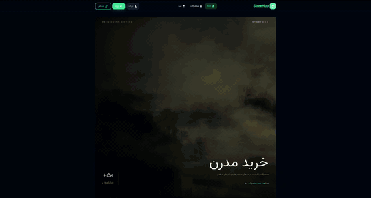

<div align="center">


<br>

<a href="https://github.com/MehdiM-Z">
  
</a>
<a href="https://www.python.org/">
  
</a>
<a href="https://fastapi.tiangolo.com/">
  
</a>
<a href="https://react.dev/">
  
</a>

<br><br>

<a href="https://github.com/MehdiM-Z">
  
</a>

</div>

---

## 👋 About Me

I'm a **Backend Developer** specializing in **Python, FastAPI, REST APIs, automation and Web3 systems**.

I have **2.5+ years of professional experience** working in the blockchain industry, building backend services, APIs, Telegram automation and Web3-related systems.

I also build **full-stack applications** when needed, with a strong focus on backend architecture, database design, authentication, authorization and maintainable APIs.

---

## 🧠 Technical Skills

<div align="center">

### Backend & Core


<br><br>

### Frontend


<br><br>

### Tools & Infrastructure


</div>

<br>

<table>
<tr>
<td width="50%" valign="top">

### 🐍 Backend

**Python**

`Expert`

`████████████████████`

**FastAPI**

`Advanced`

`███████████████████░`

**Flask**

`Advanced`

`██████████████████░░`

**REST API Design**

`Advanced`

`███████████████████░`

**PostgreSQL**

`Advanced`

`██████████████████░░`

**SQLAlchemy**

`Advanced`

`██████████████████░░`

**SQLite**

`Advanced`

`█████████████████░░░`

</td>

<td width="50%" valign="top">

### 🌐 Full Stack & Tools

**Web3 / Blockchain**

`Advanced`

`█████████████████░░░`

**Telegram Bots**

`Advanced`

`█████████████████░░░`

**Git / GitHub**

`Advanced`

`█████████████████░░░`

**Linux**

`Advanced`

`█████████████████░░░`

**TypeScript**

`Intermediate+`

`███████████████░░░░░`

**React**

`Intermediate+`

`███████████████░░░░░`

**JavaScript**

`Intermediate+`

`███████████████░░░░░`

**Docker**

`Intermediate`

`████████████░░░░░░░░`

</td>
</tr>
</table>

---

## 🚀 What I Build

<table>
<tr>

<td width="25%" valign="top" align="center">

### Backend

REST APIs

Authentication

Authorization

Database Systems

Admin Panels

</td>

<td width="25%" valign="top" align="center">

### Web3

Blockchain

Web3 APIs

On-chain Data

Wallet Integration

Backend Services

</td>

<td width="25%" valign="top" align="center">

### Automation

Telegram Bots

API Integrations

Scheduled Jobs

Reporting

Monitoring

</td>

<td width="25%" valign="top" align="center">

### Full Stack

React

TypeScript

E-commerce

Admin Systems

Responsive UIs

</td>

</tr>
</table>

---

# ⭐ Featured Projects

## 🛒 StoreHub

**Full-stack e-commerce platform built from scratch with FastAPI and React.**

A custom e-commerce system with separated frontend/backend architecture and a dedicated administration system.

### 🎬 Live Demo Preview

<div align="center">



<br><br>

**StoreHub — Full-Stack E-Commerce Platform**

</div>

### Features

* 🔐 Authentication & authorization
* 👥 User management
* 🛡️ Role & permission management
* 📦 Product management
* 🗂️ Category management
* 🛒 Shopping cart
* ❤️ Wishlist
* 📋 Orders
* 💳 Payment flow
* 📊 Admin dashboard
* 🔌 REST API
* 📱 Responsive frontend

**Stack**

`Python` `FastAPI` `SQLAlchemy`
`PostgreSQL` `Alembic` `React`
`TypeScript` `JWT` `REST API`

---

## 🤖 Telegram Automation

**Telegram-based systems for automation, reporting and business workflows.**

Built Telegram bots that communicate with external APIs and databases to automate repetitive workflows and generate useful reports.

### 🎬 Live Demo Preview

<div align="center">


<br><br>

**Telegram Automation — Bots, APIs & Reporting**

</div>

### Experience

* Telegram Bot API
* Pyrogram
* Automated reporting
* Scheduled jobs
* API integrations
* User management
* SQLite / PostgreSQL
* External service integrations

**Stack**

`Python` `Pyrogram`
`Telegram Bot API` `SQLite`
`PostgreSQL` `REST APIs`

---

## 🛒 StoreHub Architecture

```text
                    React + TypeScript
                           │
                           ▼
                       REST API
                           │
                           ▼
                    FastAPI Backend
                           │
          ┌────────────────┼────────────────┐
          │                │                │
     Authentication    Business Logic     Admin
          │                │                │
          ├── Users        ├── Products     ├── Users
          ├── JWT          ├── Categories   ├── Products
          └── Permissions  ├── Cart         ├── Orders
                          ├── Wishlist      └── Permissions
                          ├── Orders
                          └── Payments
                           │
                           ▼
                      PostgreSQL
```

---

## ⛓️ Web3 & Blockchain

My professional background is strongly connected to the **blockchain industry**, where I've worked on backend systems and applications around Web3 products.

Experience includes:

* Blockchain-related backend services
* Web3 API integrations
* On-chain data
* External blockchain services
* Automation around blockchain workflows
* Telegram systems connected to Web3 applications

---

## 💼 Professional Experience

### Blockchain / Web3 Company

**Backend / Web3 Developer · 2.5+ years**

Worked on backend systems and applications around blockchain products.

My work has included:

* Designing and developing REST APIs
* Building backend services with Python
* Working with PostgreSQL and SQLAlchemy
* Developing Telegram bots and automation systems
* Integrating external APIs and services
* Working with Web3 and blockchain-related systems
* Building reporting and monitoring workflows

---

## 🎯 Currently

```text
Building       StoreHub
Improving      Backend architecture & system design
Exploring      Web3 · Automation · Developer Tools
Working with   Python · FastAPI · PostgreSQL · React
Available for  Freelance & Remote Opportunities
```

---

## 📫 Let's Connect

<div align="center">

<a href="https://github.com/MehdiM-Z">
  
</a>
<a href="https://t.me/Z_m_Mohammad">
  
</a>

<br><br>

**Backend Systems · APIs · Automation · Web3**

<br><br>

<sub>Built with Python, curiosity and a lot of debugging.</sub>

</div>

